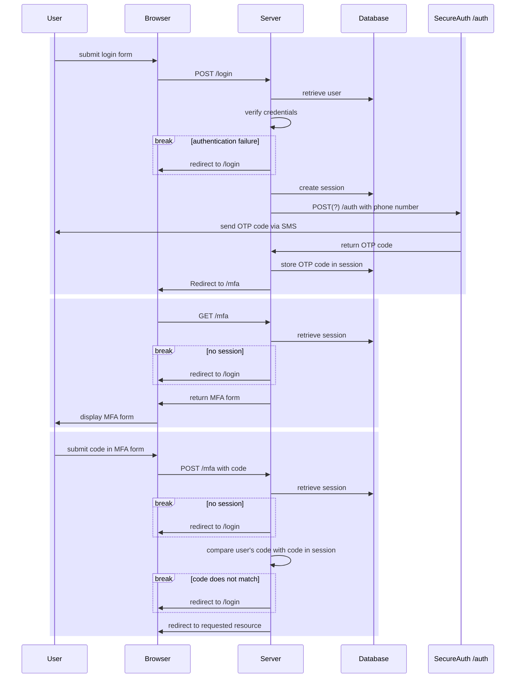

```mermaid
sequenceDiagram
    %% submit login form
    rect rgba(0, 0, 255, .1)
        User->>Browser: submit login form
        Browser->>Server: POST /login
        Server->>Database: retrieve user
        Server->>Server: verify credentials
        break authentication failure
            Server->>Browser: redirect to /login
        end
        Server->>Database: create session
        Server->>SecureAuth /auth: POST(?) /auth with phone number
        SecureAuth /auth->>User: send OTP code via SMS
        SecureAuth /auth->>Server: return OTP code
        Server->>Database: store OTP code in session
        Server->>Browser: Redirect to /mfa
    end

    %% get MFA form
    rect rgba(0, 0, 255, .1)
        Browser->>Server: GET /mfa
        Server->>Database: retrieve session
        break no session
            Server->>Browser: redirect to /login
        end
        Server->>Browser: return MFA form
        Browser->>User: display MFA form
    end

    %% submit MFA code
    rect rgba(0, 0, 255, .1)
        User->>Browser: submit code in MFA form
        Browser->>Server: POST /mfa with code
        Server->>Database: retrieve session
        break no session
            Server->>Browser: redirect to /login
        end
        Server->>Server: compare user's code with code in session
        break code does not match
            Server->>Browser: redirect to /login
        end
        Server->>Browser: redirect to requested resource
    end
```